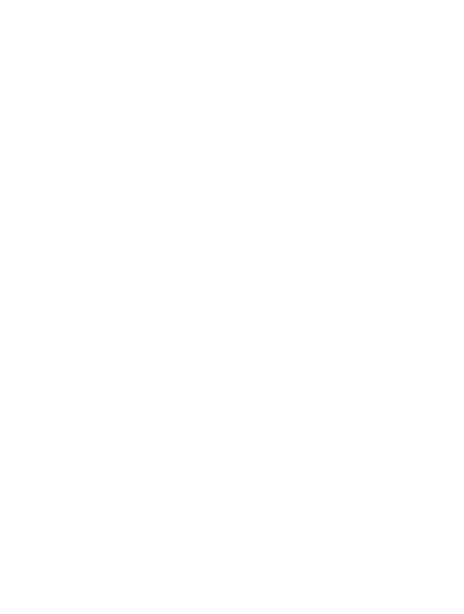
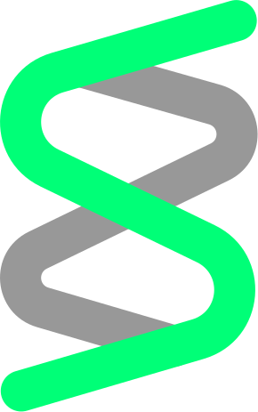
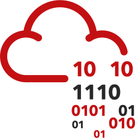

## <b> Who Am I? </b>
<!-- Profile -->
<!--  -->

  

<!-- 
<h6>🔴 🟡 🟢 What I Do</h6>
##    <b> What I Do </b> 
-->

##    <b> What I Do </b>

<!-- Tech Stack -->
## <b> How I do it </b>
<!-- Skill Icons -->
<h3 align="center">Languages & Scripting</h3>

  

<h3 align="center">Systems & Tools</h3>

  

<!-- Custom SVGs -->
<h3 align="center">Security Workflow</h3>

  &nbsp;&nbsp;
  &nbsp;&nbsp;
  &nbsp;&nbsp;
  &nbsp;&nbsp;
  &nbsp;&nbsp;
  &nbsp;&nbsp;

<h3 align="center">AI & Automation</h3>

  &nbsp;&nbsp;
  &nbsp;&nbsp;
  &nbsp;&nbsp;
  &nbsp;&nbsp;
  &nbsp;&nbsp;

<!-- Portfolio Section -->
<!--

   
  

-->

## <b> What I've Built </b>

<h4>Explore my work & projects here.</h4>

  

<!--🌌 Connect with me section -->
<!-- REPEAT FALSE-->

&nbsp;

&nbsp;

&nbsp;

<!--LinkedIn TryHackMe Hack The Box-->
---

  <i>"In a room full of developers, be the one who breaks things with purpose."</i>

