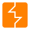
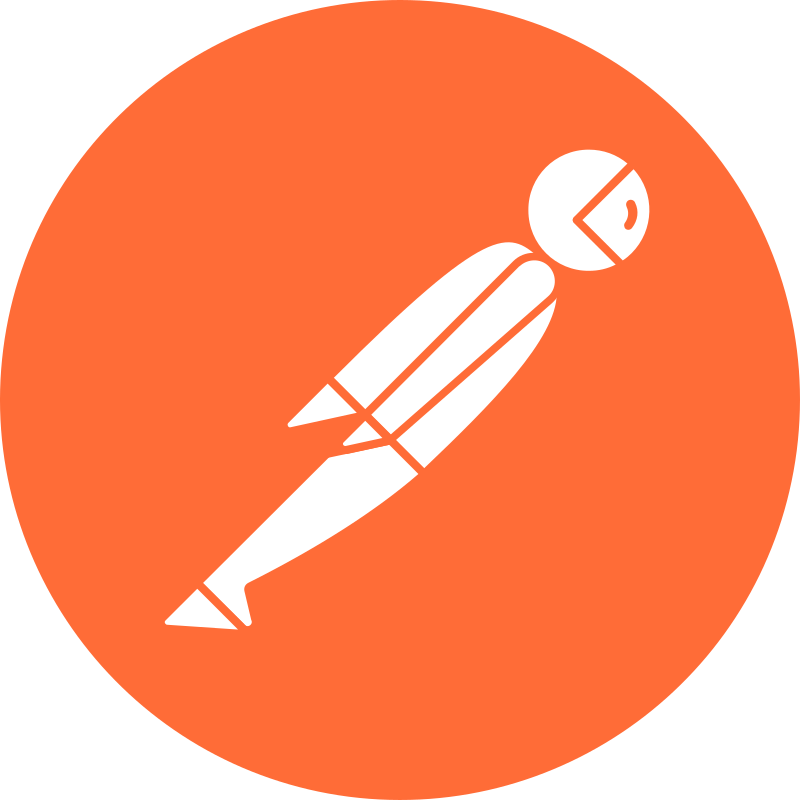
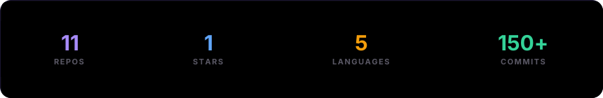
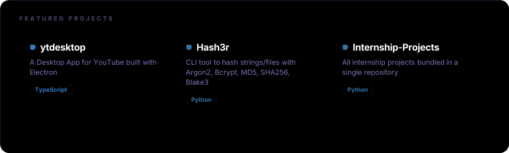

<!-- Profile: block 1. -->

## 🛠️ Tech Stack

<table>
<tr>
<td width="220"><b>Languages & Scripting</b></td>

<td align="center">
  
  Python
</td>

<td align="center">
  
  Java
</td>

<td align="center">
  
  Bash
</td>

<td align="center">
  
  PowerShell
</td>

</tr>

<tr>
<td><b>Systems & Tooling</b></td>

<td align="center">
  
  Linux
</td>

<td align="center">
  
  Windows
</td>

<td align="center">
  
  Git
</td>

<td align="center">
  
  Docker
</td>

</tr>

<tr>
<td><b>Security</b></td>

<td align="center">
  
  Burp Suite
</td>

<td align="center">
  
  Nmap
</td>

<td align="center">
  
  Wireshark
</td>

<td align="center">
  
  Postman
</td>

<td align="center">
  
  VS Code
</td>

<td align="center">
  
  Cursor
</td>

</tr>

<tr>
<td><b>AI & Automation</b></td>

<td align="center">
  
  LangChain
</td>

<td align="center">
  
  Ollama
</td>

<td align="center">
  
  Hugging Face
</td>

<td align="center">
  
  n8n
</td>

<td align="center">
  
  Strands
</td>

</tr>
</table>

